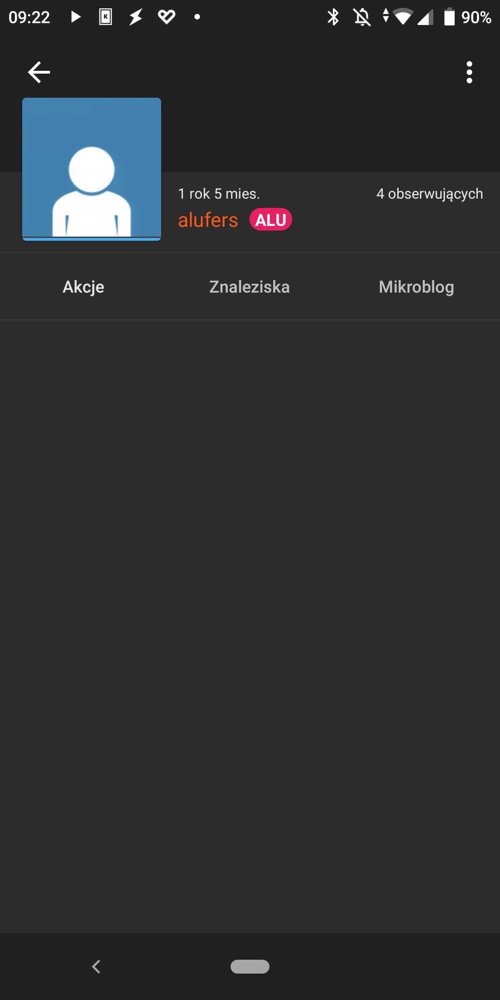

# owm patrons

A simple proxy script written in `go` that exposes the `patrons.json` file using an api hosted on [now](https://zeit.co/now). This API is used by the [OWM](https://github.com/feelfreelinux/WykopMobilny) app to display a badge for users who have backed the project on [patronite](https://patronite.pl/wykop-mobilny).

See the API in action: https://patrons.grzywok.eu/api/patrons